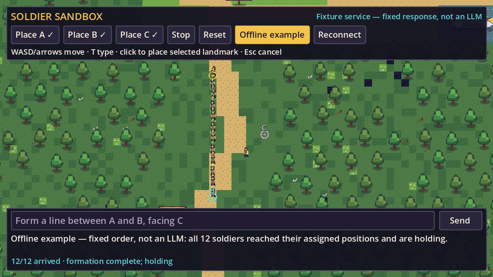
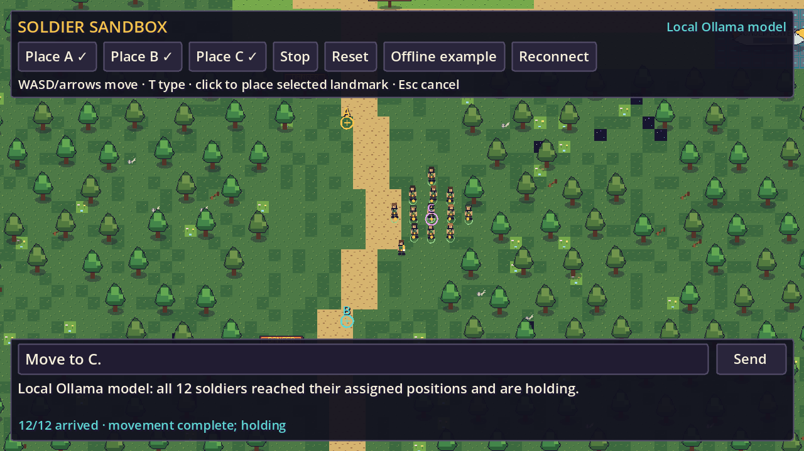
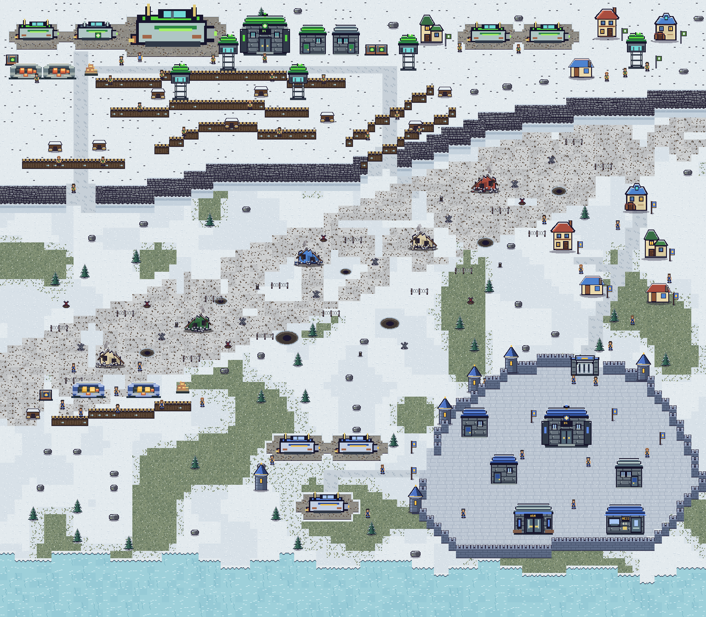
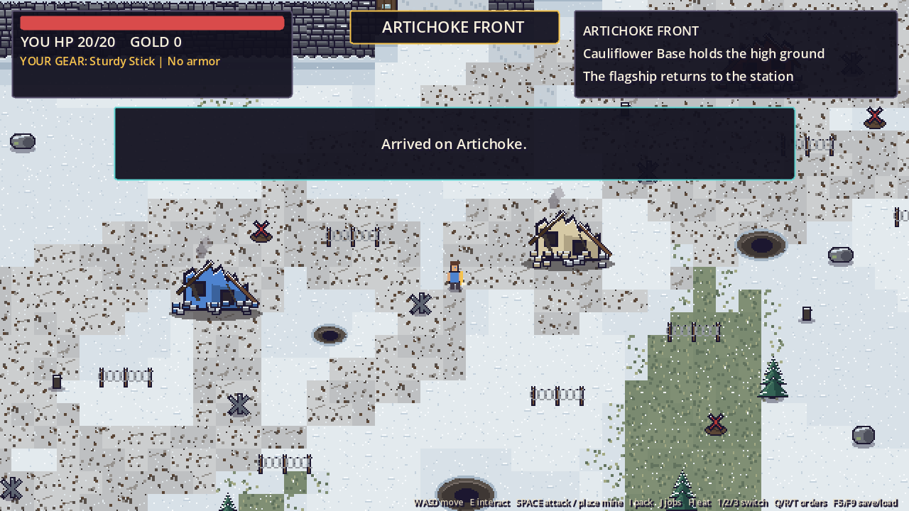
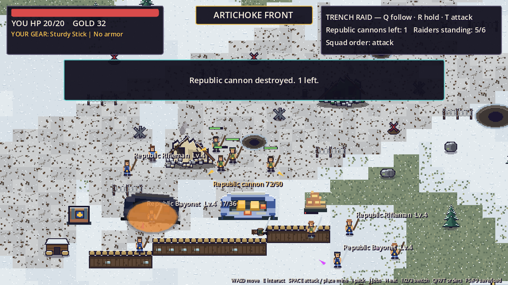
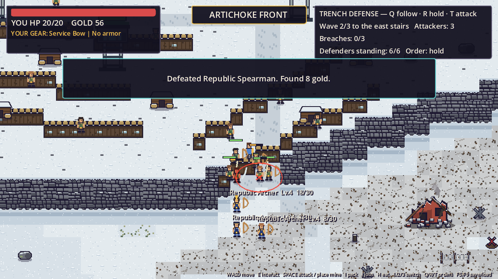

# Craft — Paprika, Brudet, the Training Station and Artichoke

A playable, single-player pixel-art prototype across three planets and a military space station. Paprika, in the Cauliflower Confederation, has an original village and a more advanced northern village separated by a long forest road. Wolves and zombies can be seen near the road, with more enemies in the forest away from it; rabbits, a bandit camp, and a level-five hacker also inhabit the woods. Brudet is another Cauliflower Confederation planet: a river world with a compact city, surrounding trees and wetlands, lakes, fishermen, bridges, markets, zombies, and fishlike monsters. The Confederation recruits at Brudet's Military Headquarters for basic training aboard a smaller station. After graduation the station's transport also flies to Artichoke, a frozen planet on the front line of the war with the New Republic. There a new arrival works through a chain of missions: draw a kit, lay mines under cannon fire, storm a Republic trench, then, promoted to Officer, lead a six-soldier raid on the Republic battery, hold the trenches against the counterattack and finally mine the Republic warships at the airfield. The setting is half medieval: there are cannons, ships and mines, but soldiers fight with swords, spears and bows.

## Start

Open `/home/antonio/Paprika/project.godot` in Godot 4.7 or newer and press **F5 in the editor** to run the project, or run from a terminal:

```bash
godot --path /home/antonio/Paprika
```

The playable Tiled source maps are `maps/paprika.tmj`, `maps/brudet.tmj`, `maps/station.tmj`, `maps/station_barracks.tmj` and `maps/artichoke.tmj`. The smaller `maps/concepts/paprika_first_view.tmj` was used for the original concept image, not the running game.

### Text-order soldier sandbox

Launch the experiment with local model interpretation; it does not load or write campaign saves:

```bash
python3 /home/antonio/Paprika/tools/run_sandbox_local.py --igpu
```

The launcher starts missing local Ollama and order-service processes, reuses compatible running servers, and opens the separate sandbox scene. On exit it stops only processes it started. It does not install software, download missing models, enable a system service, or use a cloud provider. To run just the game, without starting model services:

```bash
godot --path /home/antonio/Paprika res://scenes/sandbox.tscn
```

The sandbox reuses Paprika's map and twelve small military soldiers, without campaign villagers, enemies, harvesting or shop interactions. Starter landmarks **A**, **B** and **C** are already placed beside the forest road. Click **Offline example** to watch the soldiers form a line from A to B and face C. This button runs a **fixed order, not an LLM**, and works without a service or API key.

**Local setup:** the user-owned Ollama runtime is installed at `~/.local/share/ollama/runtime/`, with a command at `~/.local/bin/ollama`. Model files live in `~/.ollama/models/`. This sandbox defaults to `qwen3.5:2b`, a roughly 2.74 GB Q8_0 download. No provider API key is required. For a fresh setup, download the model once while Ollama is running:

```bash
OLLAMA_NO_CLOUD=1 ollama serve
# In another terminal:
ollama pull qwen3.5:2b
```

The local launcher disables Ollama cloud features for servers it starts. Vulkan discovery is available in the installed runtime, but integrated GPUs require an explicit opt-in: `python3 tools/run_sandbox_local.py --igpu` sets `OLLAMA_IGPU_ENABLE=1` only for a new server owned by the launcher. A reused server keeps its existing configuration. GPU availability does not establish that inference is faster; CPU remains an option.

For manual startup, run Ollama and then `python3 tools/sandbox_order_service.py --provider ollama`. The order service binds to `127.0.0.1:8787` and connects to Ollama at `127.0.0.1:11434`. Click **Reconnect** after starting it. `SANDBOX_MODEL` selects the local model (default `qwen3.5:2b`); `SANDBOX_OLLAMA_URL` selects its loopback HTTP endpoint. The local adapter uses a 4K context and disables reasoning only when the model explicitly supports that control. Missing models and runtime failures produce errors, never an automatic cloud request.

**Optional cloud provider:** with `ANTHROPIC_API_KEY` set in the service terminal, run `python3 tools/sandbox_order_service.py --provider anthropic`. Its default model is `claude-opus-5-5`; `SANDBOX_MODEL` overrides it. Keep the key out of project files and the game client. This provider requires an API account and has separate billing. For another local service port, use `--port 8788` and launch Godot with `SANDBOX_SERVICE_URL=http://127.0.0.1:8788`.

Type an order such as **“Move to C,” “Move only soldier_01 and soldier_02 to C,”** or **“Form a line between A and B, facing C.”** Different wording is interpreted by the selected language model, rather than matched against a fixed list of phrases. Supported actions are movement to a landmark, line formation, following the player, patrolling between two landmarks, creating a named group, and stopping, including a selection of known soldiers. Without an explicit selection, the model is instructed to select the entire squad. Missing or ambiguous landmarks and unsupported requests should produce an explanation rather than guessed instructions. One sentence carries one order; “Alpha, follow me; Beta, patrol A to B” asks for clarification. Square formations, combat and cannon crews are not implemented yet.

Try these one at a time:

1. “Create group Alpha with soldiers 1 through 6.”
2. “Create group Beta with soldiers 7 through 12.”
3. “Alpha, follow me.” — walk with WASD; Alpha follows behind you.
4. “Beta, patrol between A and B.”
5. “move group alpha to A” — Alpha leaves the follow task; Beta keeps patrolling.
6. `stop` — everyone stops at once.

**Groups** hold a fixed list of soldiers: up to eight names, lowercase letters, digits, `_` and `-`, starting with a letter; `all` is reserved and an existing name cannot be reused. Groups may share soldiers, but each soldier runs at most one task: a new order takes the selected soldiers away from their previous task, and the other soldiers in that task continue. Creating a group, a clarification, an invalid reply or a failed request does not interrupt running tasks. Groups last for the sandbox session only; Reset clears them and they are never saved. Before a local-model request, the service writes each mentioned group's members after its name in the order text (for example “alpha (members: soldier_01, …)”), because the 2B model often asked for clarification when it had to look the group up itself. Texts that create or name a group are sent unchanged.

**Following** keeps the soldiers' existing line, when they all come from one line order, at the same offsets behind and beside the player; otherwise they take two columns 24 pixels apart behind the player. Formation targets are recalculated four times a second, only after the player moves or turns noticeably. Following soldiers walk at 104 pixels per second (the player walks at 90, other orders at 52), so they catch up and then hold while the player stands still. Following never completes; it runs until Stop, a new order for those soldiers, Reset or a landmark move. If the formation does not fit around terrain or other soldiers, the group pauses and retries every half second; after eight failed attempts it is reported as blocked. The player and soldiers collide with each other and soldiers steer around the player.

**Patrol** first walks to the start landmark, then alternates between the two landmarks until stopped. The next leg starts only after every patrolling soldier has arrived; the progress list shows the current endpoint and leg count. Endpoints must be at least 24 pixels apart. If a leg cannot be planned, only that patrol is reported as blocked.

A running order service from an older version cannot interpret the new actions. The service reports protocol version 2 and its supported actions; the launcher and the game refuse an incompatible service and the launcher does not stop it or its game. To open the updated sandbox while keeping an existing window and service untouched, use:

```bash
python3 /home/antonio/Paprika/tools/run_sandbox_local.py --igpu --service-port 8788
```

An already-open Godot window does not reload these scripts automatically. Open a new sandbox window to use the updated orders.

**Interpretation limitations:** the 2B model can misunderstand equivalent wording. In a real game-context test, “Move only soldier_01 and soldier_02 to C” produced the correct order, while “Only soldier_01 and soldier_02 should go to C” incorrectly asked for clarification. The evaluator retains the latter as an expected movement case. Validation rejects malformed replies, unknown IDs and unknown landmarks, but cannot detect every valid-looking order that misinterprets the text. Stop or Reset cancels an unwanted order.

| Sandbox control | Action |
| --- | --- |
| WASD / arrows | Move the player and camera; movement stops while typing |
| Mouse wheel | Zoom in or out |
| Place A / B / C, then click the map | Place or move a landmark on open ground |
| T / Enter | Focus the order field / submit its text |
| Esc | Leave the text field or cancel landmark placement |
| Stop | Cancel pending replies and all tasks; soldiers stop where they are and groups are kept |
| Reset | Restore soldiers, player and starter landmarks |
| Offline example | Execute the fixed A–B line without a language model |

Submitting exactly `stop` (ignoring case and surrounding whitespace) runs the Stop button's cancellation immediately in the game, without an LLM or HTTP request. It works without the order service, cancels active tasks and pending replies, and prevents late replies from restarting movement. Sentences such as “stop soldier_01” or “stop alpha” still go through normal model interpretation and stop only the selected soldiers.

Submitting new text cancels only the earlier reply that has not arrived yet; running tasks continue while the model works. Moving a landmark stops every task. Late replies cannot restart a cancelled order. The sidebar lists named groups and each running task with its soldiers, progress and any blocked reason. Line positions must be reachable, with at least 24 pixels between soldiers; blocked or too-short lines are rejected without moving their endpoints. Movement assigns separated destinations within 96 pixels of the requested landmark, avoids stationary soldiers and the player, and rejects the whole order if there is insufficient reachable space. It does not move the landmark or teleport soldiers. Unselected soldiers hold their current positions. Soldiers use existing pathfinding and local avoidance, then hold their assigned positions. Optional facing is applied on arrival; without it, movement preserves the last walking direction. The progress display reports actual arrivals and movement failures. A model response alone does not count as completion. The service also interprets attack orders, which the Artichoke defense uses; the sandbox has no enemies, so it answers an attack with a status message and leaves running tasks as they are.

**Measured local results (2026-10-04):** Qwen3.5 2B on the integrated Vulkan GPU passed 21 of 28 interpretation cases (75%). Seven of eight valid movement requests were correct; the failed subset paraphrase above remains unresolved. Warm order-service latency was 8.03 seconds median and 10.88 seconds p95, including failed attempts. This run did not quite meet the under-eight-second median target and was not a cold-start test. The separate offscreen GUI test verified actual arrivals for all twelve soldiers and a selected pair; interpretation took 13.44 and 8.80 seconds respectively while those game tests were running. These are observed timings, not a response-time guarantee.

**After adding follow, patrol and groups (2026-10-04):** the same model passed 32 of 50 cases (64%), with an 11.3-second median and 20.7-second p95. The longer rules made plain movement worse: “Bring the entire squad over to A”, “Only soldier_02 and soldier_05, go to B” and “Send soldier_07 to A” now fail. Group references are unreliable even with members written into the text: “move group alpha to A” was answered with a clarification, and in the GUI test “Group alpha, follow me in formation” became a line of all twelve soldiers between A and B. Group creation by name worked in the GUI test. The game executed every reply as given; these are interpretation errors.

**Model data:** each request contains your prompt, soldier IDs and current positions, the `all` group and named groups with their members, and landmark IDs/coordinates. With Ollama, inference uses locally downloaded weights and loopback HTTP; prompts are not sent to a cloud provider. Downloading the runtime and weights requires internet access, but local inference does not. The optional Anthropic provider sends request data to its API and follows that account's retention settings. Neither mode sends campaign saves, screenshots or project files. Cancelling in the game prevents execution of the reply but may leave an already-running inference request computing until it finishes or times out.

For offline HTTP integration testing, run `python3 tools/sandbox_order_service.py --fixture`. Fixture mode always returns the same A–B line (facing C when C exists), regardless of the prompt, and is labelled **not an LLM**. It tests the request path, not language understanding.





### Campaign controls

| Key | Action |
| --- | --- |
| WASD / arrow keys | Walk |
| Shift | Sprint during the station's timed running drill |
| E | Interact, harvest, speak, or **catch** a rabbit |
| Space | Attack with the equipped weapon; during the trap drill, place an equipped practice mine; on Artichoke, plant a readied field mine |
| I | Open inventory, use food, or change equipment |
| J | View active jobs, choose one to track, or abandon a job |
| H | Eat an available food item to restore health |
| 1 / 2 / 3 | Control yourself / first recruit / second recruit after deploying |
| Q / R / T | Tell the other squad members (or the six soldiers on Artichoke) to follow / hold / attack nearby enemies |
| F5 | Save |
| F6 | Add 100,000 gold for testing (debug builds only) |
| F9 | Load the saved game |
| Esc | Close a menu, pause, or resume |

In a debug build, press **F6** to add testing gold, then **F5** if you want it in your save. Release builds do not have the F6 shortcut.

**Rabbit hunting and catching are different.** Catching a rabbit with **E** counts toward the five-rabbit work-office job; attacking a rabbit gives meat instead. The food shop buys rabbit meat. Rabbits respawn after a short interval, so the job remains possible. The on-screen interaction prompt appears within about 45 pixels of a rabbit.

### First things to try

1. Follow the road north from the village square to the **WORK** office and accept **Help in the Common Fields**.
2. Harvest five crops with **E** in the common fields south and southwest of the square. Private plots do not count and cannot be harvested.
3. Return to the work office to claim **10 gold**. Crops regrow after **120 seconds** of unpaused play.
4. Accept the rabbit-catching job and a mercenary job at the same time. Each job keeps its own progress; press **J** to view them all, choose which one the HUD tracks, or abandon one. Claim each completed job at the office that offered it. A stick is starting equipment. The first-village forge sells wooden swords, spears, bows, and armor; the northern forge sells bronze gear; Brudet's forge sells iron gear. Clothes are sold at the clothiers. Equipment you already own stays usable wherever you travel.
5. Sell crops or rabbit meat at the food shop. Enter at the shop's door; the private crops are farther north, away from the building. The level-five hacker is intentionally much stronger than starting equipment.
6. The first-village **MERCENARY** center offers solo bounties, including a bandit near the southern village, and **Clear the Forest Road**, a squad job targeting three distinct zombies already on the road. Claim that road reward to unlock **Clear the Bandit Camp** at the northern **MERCENARY** center. Claim the camp reward to unlock the solo Paprika hacker bounty at the southern center. The southern office recruits only first-village residents, while the northern office recruits only northern residents for its off-road camp. Existing road encounters remain, with additional enemies and rabbits in clearings away from the pavement. Each recruit appears with a stable ID, so villagers with the same name can be distinguished. You may replace undeployed recruits and equip them with gear you own. Each equipped item needs its own inventory copy. Giving a recruit a weapon or armor you currently wear transfers your copy to them and removes it from your equipment. If that was your only weapon, equip another before attacking.
7. Deploy the three-person squad and head for the selected mission's marked targets. Press **1/2/3** to switch whom you control. **Q** orders the others to follow, **R** to hold, and **T** to attack nearby enemies; these shortcuts do not act while a menu is open. The HUD shows squad health, orders, and recovery. Claim the reward at the office that issued the job after all distinct targets fall. A deployed team mission cannot be abandoned. Unrecruited villagers flee monsters; deployed recruits follow squad orders instead.
8. Follow the road north through the forest to the second village. Watch for monsters among the trees; the path leads into the northern square. Visit its food shop for rye bread, berry pie and smoked fish; its clothier for purple cloth and a purple tunic; and its forge for bronze weapons and armor. Both spaceships and Paprika's sole travel agency are in the northern village. **Visit Brudet** costs **1,000 gold**; opening the agency or attempting to travel without enough gold costs nothing. Recruits cannot cross planets: dismiss assembled recruits before deployment, or finish a deployed team mission before leaving either planet. Returning from Brudet costs another **1,000 gold**.
9. On Brudet, visit the central market to buy a **fishing rod**, fish stew, olive bread, and citrus. Press **E** beside a fishing pond to catch river fish; a short cooldown separates catches. The market buys fish and offers a three-fish job. Brudet's forge sells iron weapons and armor. Use the stone bridges to cross the river: open water stops people, though fishlike monsters can swim across it. The wooded wetlands beyond town hold zombies, including armed and armored ones, and a ranged river monster. Brudet Town Hall offers solo river-monster patrol and teleporting-hacker jobs, plus two recruitable squad jobs with targets **outside the city**: clear river monsters or clear a bandit camp. Spear, bow, and sword bandits wear red, blue, and purple respectively, along with light bronze armor. Only one team job can be active at a time, and the solo hacker mission cannot run alongside a team job. The green Military Headquarters offers **Join the Military**, an immediate free trip to the training station beside a regular ship. Finish or dismiss your civilian squad before traveling. A practice arrow target stands beside headquarters. Read the library's Craft history and local guidance, then pay **1,000 gold** at the Brudet agency to return to your saved Paprika position.
10. At the station, collect your distinct green uniform from the depot. Enter the barracks and put your personal inventory, including equipped civilian gear, in **your assigned chest**. Gold remains currency; your stored possessions keep their exact counts. Nine other recruits have their own bunks and chests. Speak to them with **E** for conversations that vary with their homes and your training progress.
11. Press **J** for the current objective and its location. Start each drill at its flag by choosing **Use training station**. In order: sprint through timed running checkpoints; use **Space** to spar with a moving partner; fight beside two recruits in a nonlethal three-on-three bout (**Q** follow, **R** hold, **T** attack); shoot three moving targets with the issued training bow; start the cannon round at its separate range flag, then use **E** at the supply pile and cannon to collect a game charge, load, and fire. Watch the cannonball arc and burst; a target counts only on impact. For the trap drill, start at its pad, open **I** to equip one nonfunctional practice mine, then face the dummy's lane and press **Space** to place it. The dummy must cross the placed marker to count; restart practice at the pad if needed. Each completed drill earns one canteen meal, which restores health. The instructor explains the current exercise. Training knockouts do not count as civilian kills or job progress.
12. After all six drills, sleep in **your** barracks bed to graduate and heal. Your chest then lets you retrieve your original gear. The regular ship returns to your saved Brudet position for free; belongings left in the chest remain there until you collect them on a later visit. Returning through Military Headquarters does not issue a second uniform.
13. After graduating, the station's transport also offers **Deploy to Artichoke** for free. You arrive on cleared, snow-free ground beside the Confederation flagship at Cauliflower Base, on the high ground in the north. Trenches with sandbags, bunkers, watchtowers and cannons face south across no man's land: craters, barbed wire, steel hedgehogs, red minefield marks and five ruined houses. The New Republic, in blue and gold, holds a walled stone base in the southeast with its own escort ships and an occupied village to the east. Cliffs block the plateau edge except at two ramps, and the frozen sea in the south blocks movement. Confederation soldiers talk with **E**. Republic soldiers in the main base and village stand guard and do not fight; the Republic buildings cannot be entered yet. The flagship takes you back to the training station, and your Artichoke position is saved for the next deployment.
14. **Arrival on Artichoke.** The HUD tells you to report to **Captain Vela** beside the flagship. She greets you with "Where have you been soldier, taking a piss huh?" and sends you to the **Arms** building east of the barracks (past the east stairs, along the path). The quartermaster there issues your kit once: a **service bow** (put in your hands), an **iron spear**, **wooden armor** (worn unless you already wear armor; it takes 1 off every hit), three **field mines** and two **bandages**. Later visits replace a lost bow, spear or armor and top up bandages. Field mines are limited by stage: one for each open mine-duty spot, none for the assault and the raid, six for the counterattack, and what the standing warships need for the fleet strike. The quartermaster issues none while an operation is under way. A bandage heals 20 health; **H** uses one when you carry no food. The **Mess** beside Arms, or its cook, serves a free hot meal that heals you fully, but not while a mission is running.
15. **Mine duty.** Vela sends you below the cliffs to plant a field mine on each of three spots marked with yellow rings: ready a mine with **I** and press **Space** on the ring. While you work, the Republic battery fires every 5 to 8 seconds at the spots still open. During the duty a mine can only be planted on a ring, so none of the three is wasted; if you fall, the Arms building issues one mine for each ring still open. If you fall, the spots already laid stay laid and you can go out again. Laying all three pays 60 gold.
16. **The trench assault.** "Huh, you survived. You are tougher than the last one." Six soldiers join you against a Republic forward trench west of the occupied village, where six Republic soldiers wait. One of them, chosen at random each time, is marked **TARGET**; the assault is won when he falls, whoever brings him down. It fails if you fall or all six soldiers go down. Winning pays 100 gold, and Captain Vela promotes you to **Officer** and offers the raid.
17. **The trench raid on Artichoke.** Two New Republic cannons dug in on the western side of no man's land (the southwest battery) each fire a shell at the Confederation trenches every 8 to 13 seconds. A red ring with a cross marks where each shell will land 2.2 seconds before it hits; anyone inside the ring when it lands takes damage. Confederation cannons answer with counter-fire on the Republic base. Talk to Captain Vela at the flagship for the briefing. The Arms building issues no field mines for the raid; mines left over from earlier can still be planted. Choose **Lead the trench raid** and six soldiers join you: three archers, two spearmen and a swordsman, each with a health bar. **Q** makes them follow in formation, **R** makes them hold where they stand, and **T** sends them at the nearest Republic soldier, or at the nearest cannon when no soldier is in sight. Eight Republic soldiers guard the battery from its trench: six archers who keep to their posts and two who charge, a spearman and a swordsman; and three reinforcements march from the airfield when you get close. Soldiers in a trench are hard to hit from range: 70 percent of arrows shot from more than 56 pixels away hit the parapet and throw up dust, so close in with spear and sword. The red marks in no man's land are real minefields of three mines each that go off under anyone, and walking routes avoid them; barbed wire can be crossed but slows movement to 40 percent. Ready a field mine from the inventory (**I**) and press **Space** to bury it at your feet; it arms after 1.5 seconds and goes off only under Republic soldiers. At a cannon, press **E** to plant a demolition charge and get clear of its ring before the four-second fuse runs out. Destroying both cannons ends the bombardment for good, pays 150 gold and sends the surviving raiders back to base. The raid fails if you are defeated or all six raiders go down; any cannon already destroyed stays destroyed, the other is repaired and the garrison returns. Destroyed cannons are recorded in the save.
18. **The Republic counterattack.** After the battery falls, Captain Vela warns that Republic infantry is massing at the airfield and offers **Hold the trenches with six soldiers**. The same squad deploys, and 15 seconds later the first of four waves (4, 6, 8 and then 12 swordsmen, spearmen and archers; the last wave has four of each) marches up the field. There are two ways up to Cauliflower Base, the west ramp and the east stairs. The first wave takes the west ramp; the other three split, half to each, so the squad has to cover both. The announcement and the HUD name the ramps. Confederation cannons shell the advancing wave with the same warning rings, the trench parapet stops Republic arrows as it stopped yours, barbed wire slows the attackers and your buried field mines go off under them. Draw six field mines at Arms before you start. If the defense is lost, the quartermaster replaces only the mines that went off; the others stay buried and count against the six. Planted mines are not saved, so after loading a save all six are issued again. The next wave sets off 8 seconds after the last soldier of a wave falls. After the third wave Captain Vela sends a fresh soldier for every defender who is down (Halvard, Sigrun, Oskar, Teodor, Liesl or Anselm, by place in the squad). Each takes the fallen soldier's weapon and group, starts at the captain and follows you, and the last wave comes 16 seconds later instead of 8. The defense is lost if three attackers reach the top of the ramps, you are defeated, or all six defenders go down; the field is then cleared and it can be tried again. Beating the fourth wave pays 200 gold and is recorded in the save.
19. **General Hickey and the Republic fleet.** After the counterattack Captain Vela is gone and **General Hickey** stands in her place. He tells you she deserted during the trench attacks, which leaves you the highest-ranked soldier on Artichoke, and that the Republic has been repairing its broken warships at the airfield so they can bombard Cauliflower Base; the only way to stop them is to destroy the warships first. Draw six field mines at Arms and choose **Lead the strike on the warships**: six soldiers go with you, and six Republic guards stand around the airfield. Press **E** beside a hull to plant a field mine. One mine destroys an escort and the flagship needs three; the last mine lights a four-second fuse, so get clear. If the strike fails, ships already destroyed stay destroyed and the mines come off the others. Destroying all four pays 300 gold. Report back to General Hickey: he praises your bravery, promotes you to **Captain** and sends you to Pomidor, the Confederation capital, to tell the Council what was done on Artichoke. Pomidor is not in the game yet, so for now this order is the end of the Artichoke chain. Every step of the chain is recorded in the save; a save from before the chain existed that already has a cannon destroyed starts at the raid.

   **Typed orders.** During the defense, press **Enter**, type an order for the squad and press **Enter** again; **Esc** closes the order bar. While the order bar is open the battle runs at a quarter of normal speed. The squad starts in three groups that follow its weapons: the **bowmen** (Brannock, Ilse, Petra), the **spearmen** (Corwin, Maren) and the **swordsmen** (Dusan). Orders can name a group, a soldier ("Petra"), several of them or everyone, and one of three places marked on the map with gold rings: **the west ramp**, **the east stairs** and **the centre trench**. Examples: "bowmen to the centre trench", "spearmen patrol between the west ramp and the east stairs", "swordsmen follow me", "everyone form a line from the west ramp to the east stairs", "create group left with Brannock and Corwin", "bowmen attack", "spearmen attack at the east stairs". Each group keeps its own task, and the HUD lists them. A soldier given a place walks there and holds it; a patrol walks between two places until another order arrives. An attack without a place sends the soldiers after the nearest attacker anywhere on the field; with a place they go there and fight attackers within 150 px of it, and wait there when none are left. Without attackers on the field they wait where they are. Soldiers still fight anyone within their weapon's reach. Typing "stop", "halt" or "hold" makes everyone hold where they stand without the order service, and **Q**, **R** and **T** always work.

   **Marked places.** Stand somewhere and type "mark here as tower" (also "name this place tower" or "mark tower here") to add a place of your own; it gets a blue ring and label on the map, the HUD lists it, and later orders can name it: "bowmen to the tower", "spearmen patrol between the tower and the east stairs". Typing the name again somewhere else moves it, and "forget tower" removes it; soldiers already sent there stay. Up to five places can be marked. A name is one to three words of letters and cannot be a soldier, group or existing place, or contain a word orders use, such as "attack" or "here". Marking and forgetting are handled by the game, so they work without the order service. Marked places last until the game closes and are not saved.

   Typed orders need the local order service: `python3 tools/sandbox_order_service.py` starts it on `127.0.0.1:8787` with its default provider, a small BERT order tagger (`models/order_tagger`, needs PyTorch and transformers) that runs on the CPU in a few milliseconds per order. The HUD says whether the service is reachable. The game turns place names, soldier names and spellings such as "archers" or "swordmen" into what the service expects (landmarks A, B and C, marked places as D to H, "soldier 4", "bowmen") before sending, and checks the interpreted order again before any soldier moves. When the tagger cannot tell what was meant it asks instead of guessing, and an order it cannot carry out, such as a line of six across the ground between the west ramp and the centre trench, is refused with the reason.

Matching plaques identify FOOD, FORGE, WORK, MERCENARY, CLOTHES, and TRAVEL services; visit a door to open its menu. The northern village has taller houses, its own fountain square, and a landing area for both ships. A long forest road links the two settlements. Wooden **COMMON** signs and fences mark public fields in both villages; **PRIVATE** marks gardens that cannot be harvested. Fence openings are the entrances. **FOREST** signs show routes into the woods, while **DANGER** marks the darker forest where enemies may be nearby. Wooden signs are landmarks, not interaction points.

There are **40 active villagers: 15 in the original village and 25 in the north**. Farmers work their own village's common-field rows and take breaks; other residents carry out local errands at shops, the work office, and the village squares. Their small gestures and conversation reflect what they do. Recruited villagers pause those errands while deployed with the squad and resume when released. Villagers and the player do not have an experience-level system yet: a displayed level describes relative fighting ability, while equipment provides the current player progression.

## Editing the world and art

Open the live map in Tiled:

```bash
tiled /home/antonio/Paprika/maps/paprika.tmj
tiled /home/antonio/Paprika/maps/brudet.tmj
tiled /home/antonio/Paprika/maps/station.tmj
tiled /home/antonio/Paprika/maps/station_barracks.tmj
tiled /home/antonio/Paprika/maps/artichoke.tmj
```

All five finite orthogonal Tiled JSON maps reference external `.tsj` tilesets and PNG art. Terrain uses 16×16 tiles. The game reads the `.tmj` and `.tsj` files at startup, so changing a supported tile or object and restarting changes the playable world. The layers **Common Fields** and **Private Fields** decide whether harvesting is allowed. Paprika's **Field Boundaries and Forest Details** layer draws fence tiles and debris; intact fence tiles block movement, so keep openings when editing a field. Brudet's **Water** layer blocks players, villagers, rabbits, and land enemies wherever it has a tile; fishlike river monsters can cross it. Leave bridge-deck cells empty in that layer. New named shops or enemies also need matching rules in `scripts/world/tiled_loader.gd` and, for shops, `scripts/ui/game_ui.gd`. Paprika's bandit camp marker and its three mission enemies appear dynamically only after its squad deploys; road-cleanup targets are three existing map zombies. Brudet's camp marker and team enemies appear only while their corresponding mission is deployed. The solo teleporting hacker appears in Brudet's northern outskirts while that job is active. The job list (**J**) keeps a location hint for each combat mission. On the station map, keep **Station Void** cells around the irregular platform so the space beyond its edges remains visible but cannot be walked into; **Station Walls** and **Barracks Walls** also block movement. On Artichoke, **Water** (the frozen sea) and **Artichoke Cliffs** block movement, **Artichoke Decals** (sandbag rims and craters) can be walked over, and each `republic_wall` object blocks its whole 16-pixel tile.

The art is original and local. Open `art/concepts/paprika_tileset.aseprite` for the first terrain tiles. Most buildings, enemies, clothing, and Brudet river art have editable `.aseprite` files under `assets/art/`. The northern mercenary office, Brudet forge, zombie variants, swamp pools, willow trees, and marsh tiles have editable `.svg` sources beside their PNGs. LibreSprite opens the `.aseprite` and PNG files:

```bash
sprite /home/antonio/Paprika/art/concepts/paprika_tileset.aseprite
sprite /home/antonio/Paprika/assets/art/clothing_shop.aseprite
```

Map references: `art/concepts/paprika_first_view.png`, `art/concepts/paprika_world_layout.png`, `art/concepts/brudet_world_layout.png`, `art/concepts/station_world_layout.png` and `art/concepts/station_barracks_layout.png`. The game renders separate tiles, characters, crops, and buildings rather than displaying these static previews.

### Paprika map

The full playable map shows the original village to the south, the forest road with off-road rabbits and monsters, and the northern village with its travel agency and two ships. The southern bandit bounty now lies in the forest near the first village.


### Brudet map

The full playable map shows Brudet's compact east-bank town, western fishing neighborhood, quiet lake, fields, two bridges, and wooded marshland extending east and south. The southeastern wilderness has a separate lake with fishlike monsters and an accessible fishing shore, away from resident homes. Outer paths lead to the lake and other monster encounters.


### Training station and barracks

The playable station has a regular transport by the west landing area, two noninteractive warships in the eastern launch area, a depot, canteen, training grounds, and ten exterior barracks. Only your assigned barracks can be entered; it contains ten bed-and-chest pairs around a central carpeted aisle. Soldiers in matching small, medieval-inspired uniforms work and walk around the station. The visible space edge makes the irregular platform clear; the three-ship [military base concept art and sprite sources](assets/art/space_military_base/README.md) remain separate from the playable station.


### Artichoke

The Artichoke map is 96 by 84 tiles. Cauliflower Base fills the plateau in the north, with the flagship and three escort ships standing on cleared ground and houses with Confederation flags on the eastern high ground. The Republic base has three escort ships on cleared ground west of its wall. `tools/create_artichoke_concept.py` holds the layout and draws `art/concepts/artichoke_concept.png`; `tools/build_artichoke_map.py` writes the same layout as `maps/artichoke.tmj`, `maps/artichoke_terrain.tsj`, `maps/artichoke_objects.tsj` and the art in `assets/art/artichoke/`. Rerunning it replaces manual edits to those files.





The southwest battery is built from map objects: two `republic_cannon` objects become destructible cannons (`scripts/world/battery_cannon.gd`), `republic_battery_soldier` objects mark the garrison posts, `confederation_officer` places Captain Vela (and later General Hickey), `confederation_arms`, `confederation_mess` and `confederation_cook` are the Arms building, the Mess and its cook, the `republic_warship_escort` and `republic_warship_flagship` objects at the airfield become mineable warships (`scripts/world/republic_warship.gd`), each `trap_marker` gets three buried mines (`scripts/world/field_mine.gd`), and each `barbed_wire` object slows movement inside its area. The map property `trench_cells` lists the trench tiles that give cover. `scripts/world/artichoke_world.gd` runs the story stages (`story_stage()`), mine duty (`MINE_DUTY_SPOTS`), the trench assault (`ASSAULT_POSTS`), the fleet strike, the raid, artillery (`scripts/world/artillery_shell.gd`) and reinforcements, and `scripts/actors/raid_soldier.gd` controls the six raiders.



The counterattack also runs in `scripts/world/artichoke_world.gd`: `DEFENSE_WAVES` lists each wave's soldiers, `WAVE_RAMPS` picks the ramp each wave attacks and `BREACH_POINTS` are the ramp tops. Republic soldiers follow walking paths when they chase, so they climb the ramps instead of pressing against the cliffs.

Typed orders use `scripts/orders/squad_order_client.gd` for the HTTP requests and `ORDER_PLACES`, `STARTING_GROUPS` and `GROUP_WORDS` in `artichoke_world.gd` for the places and group names; places the player marks are added to `order_places` as letters D to H. An attack order becomes the `hunt` order in `scripts/actors/raid_soldier.gd`, which looks for targets without the sight limit of the **T** attack. The waves, their ramps and the relief after the third wave are `DEFENSE_WAVES`, `WAVE_RAMPS` and `RELIEF_AFTER_WAVE` in `artichoke_world.gd`. Placement reuses the sandbox's `SandboxFormationPlanner`, so soldiers sent to one place get separate spots at least 24 px apart. The tagger is trained from sentences produced by `tools/generate_order_dataset.py`; `tools/train_order_tagger.py` trains it and writes a report of its accuracy.



`tools/create_paprika_concept.py`, `tools/create_extra_art.py`, and `tools/build_paprika_world.py` generated Paprika's first versions. `tools/build_brudet_world.py` generated Brudet's initial map. **Do not rerun these generators over manually edited art or maps** unless you intend to replace the changes. `tools/render_tiled_map.py` can render the maps without changing them:

```bash
/usr/bin/python3 /home/antonio/Paprika/tools/render_tiled_map.py /home/antonio/Paprika/maps/brudet.tmj ~/Pictures/brudet-preview.png
```

## Testing

```bash
godot --headless --path /home/antonio/Paprika --editor --quit
run_isolated() {
    local test_home result
    test_home=$(mktemp -d)
    XDG_DATA_HOME="$test_home" godot --headless --path /home/antonio/Paprika "$@"
    result=$?
    rm -rf "$test_home"
    return "$result"
}
run_isolated --script res://tests/run_tests.gd
run_isolated --quit-after 700 res://tests/world_smoke.tscn
run_isolated --quit-after 700 res://tests/brudet_smoke.tscn
run_isolated res://tests/station_smoke.tscn
run_isolated res://tests/artichoke_smoke.tscn
run_isolated --script res://tests/sandbox_tests.gd
run_isolated --fixed-fps 60 res://tests/sandbox_smoke.tscn
PYTHONDONTWRITEBYTECODE=1 python3 -m unittest discover -s /home/antonio/Paprika/tests -p 'test_sandbox*.py'
```

The sandbox tests check line and movement assignment, actual all-soldier/subset arrivals and avoidance, cancellation, invalid or late replies, text-focus handling, and campaign-state/save isolation. Verification on 2026-10-04 passed 146 Python tests, 276 Godot unit checks, three normal-timing fixture smoke runs of 186 checks each, and a real local movement smoke run of 199 checks. The subsequent instant-stop update passed 198 smoke checks, including case/whitespace matching, cancellation of pending replies, stationary soldiers after late replies, and Enter submission through the text field without a valid service. The follow, patrol and group update passed 172 Python tests, 444 Godot unit checks, four normal-timing smoke runs of 252 checks each and a fixture HTTP smoke run of 259 checks. The smoke runs physically check a following group and a patrolling group running together (at least three patrol legs), that group creation, clarification, rejected orders and failed requests leave both running, that a partial order or stop takes only the selected soldiers, that a preserved line follows its leader, and that exact `stop`, landmark moves and late replies leave no task running. These code and physical-movement results are separate from the model's interpretation score above. For fixture HTTP regression testing, start the service with `--fixture`, then run `SANDBOX_HTTP_TEST=1 run_isolated --max-fps 60 res://tests/sandbox_smoke.tscn`. This test refuses to submit orders unless the service reports fixture mode; it does not test language understanding.

For real local movement interpretation, start the updated Ollama-backed service on an unused port, then use:

```bash
SANDBOX_SERVICE_URL=http://127.0.0.1:8788 SANDBOX_MOVE_LOCAL_TEST=1 run_isolated --max-fps 60 res://tests/sandbox_smoke.tscn
python3 /home/antonio/Paprika/tools/evaluate_sandbox_orders.py --service-url http://127.0.0.1:8788 --output ollama-orders-evaluation.json
```

The movement smoke test submits real all-soldier and subset orders and waits for physical arrivals. The evaluator checks action, exact soldier selection, destination/endpoints, and facing across 50 cases covering varied wording, named groups, follow, patrol, group creation and unsupported requests, including the failed subset paraphrase with the same float coordinates sent by the game. Use normal timing for model/HTTP tests: `--fixed-fps` accelerates the game clock and can make HTTP requests time out before real inference finishes. Choose a new output filename for each evaluation. Optional `--cold` unloads the model before measuring; avoid it while another game is using that model.

Use a **separate** temporary `XDG_DATA_HOME` for each test process, particularly for world smoke tests that write save files. Normal game saves go to Godot's `user://paprika_save.json`; F5 writes a previous-save backup alongside it, and F9 restores the save, including the current planet and area, the player's exterior and barracks positions, fishing cooldown, Paprika and Brudet team progress, assigned-chest contents and military training progress. Schema-one through schema-four saves migrate when loaded, including Paprika positions and field regrowth across the longer forest map. Schema-five positions stay unchanged; schema-six and schema-seven saves, including in-progress Brudet hacker squads, remain loadable. Previously accepted hacker squad jobs can be finished as started; newly accepted Brudet hacker jobs are solo. Schema-eight, schema-nine and schema-ten saves remain loadable and keep their station progress and positions; loading them adds the Artichoke arrival position, and the next F5 writes schema eleven, which also records the Artichoke position. An unfinished cannon shot reloads as loaded and scores only after the player fires and it hits. An active trap round reloads with its held or placed practice mine and progress. Older saves do not record whether a repeatable road job was claimed, so players who cleared the road but never unlocked or accepted the camp may need to claim it once more. Saving does not overwrite Tiled maps or sprite files.

## This version's boundaries

Paprika and Brudet are playable exterior worlds; the smaller training station also has a playable exterior and the first enterable building, its barracks. Other buildings remain interaction points rather than indoor scenes. Daylight does not change. NPC conversations, routines, equipment, the economy, and combat are prototype systems that can be extended; there is no multiplayer, spaceship flight, Block modification system or playable New Republic yet. Artichoke combat is limited to the mission chain: mine duty, the trench assault, the battery raid, the counterattack and the fleet strike.
