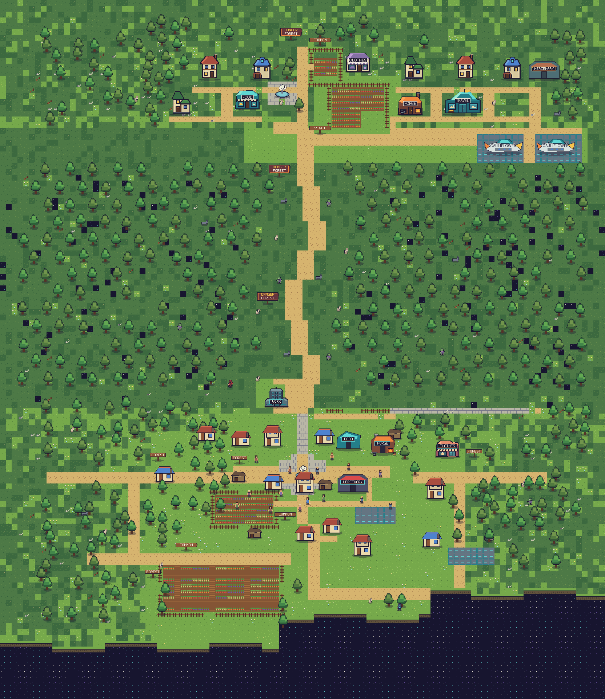
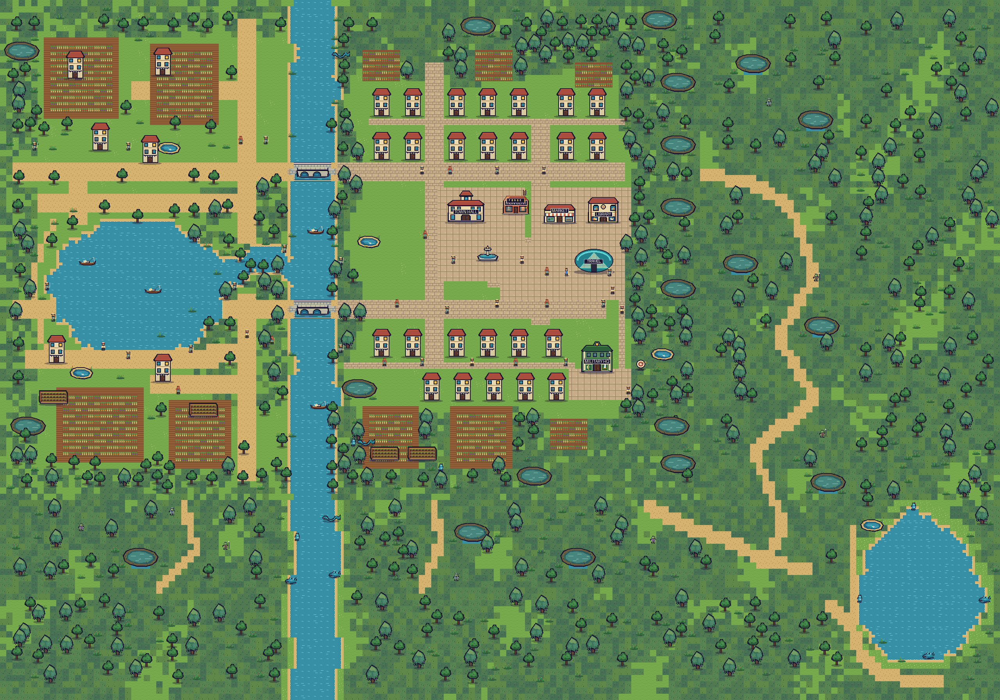
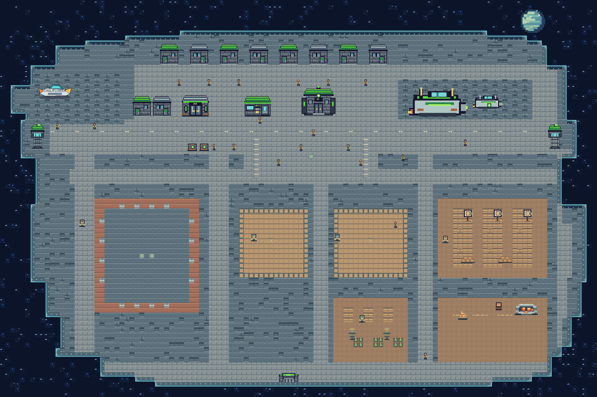
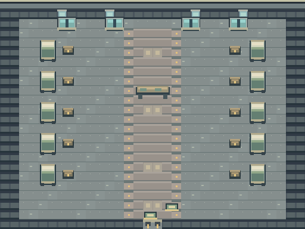

# Craft — Paprika, Brudet and the Training Station

A playable, single-player pixel-art prototype across two planets and a military space station. Paprika, in the Cauliflower Confederation, has an original village and a more advanced northern village separated by a long forest road. Wolves and zombies can be seen near the road, with more enemies in the forest away from it; rabbits, a bandit camp, and a level-five hacker also inhabit the woods. Brudet is another Cauliflower Confederation planet: a river world with a compact city, surrounding trees and wetlands, lakes, fishermen, bridges, markets, zombies, and fishlike monsters. The Confederation recruits at Brudet's Military Headquarters for basic training aboard a smaller station. The war with the Republic remains background story; battlefield deployment is not playable.

## Start

Open `/home/antonio/Paprika/project.godot` in Godot 4.7 or newer and press **F5 in the editor** to run the project, or run from a terminal:

```bash
godot --path /home/antonio/Paprika
```

The playable Tiled source maps are `maps/paprika.tmj`, `maps/brudet.tmj`, `maps/station.tmj` and `maps/station_barracks.tmj`. The smaller `maps/concepts/paprika_first_view.tmj` was used for the original concept image, not the running game.

### Controls

| Key | Action |
| --- | --- |
| WASD / arrow keys | Walk |
| Shift | Sprint during the station's timed running drill |
| E | Interact, harvest, speak, or **catch** a rabbit |
| Space | Attack with the equipped weapon; during the trap drill, place an equipped practice mine |
| I | Open inventory, use food, or change equipment |
| J | View active jobs, choose one to track, or abandon a job |
| H | Eat an available food item to restore health |
| 1 / 2 / 3 | Control yourself / first recruit / second recruit after deploying |
| Q / R / T | Tell the other squad members to follow / hold / attack nearby enemies |
| F5 | Save |
| F6 | Add 100,000 gold for testing (debug builds only) |
| F9 | Load the saved game |
| Esc | Close a menu, pause, or resume |

In a debug build, press **F6** to add testing gold, then **F5** if you want it in your save. Release builds do not have the F6 shortcut.

**Rabbit hunting and catching are different.** Catching a rabbit with **E** counts toward the five-rabbit work-office job; attacking a rabbit gives meat instead. The food shop buys rabbit meat. Rabbits respawn after a short interval, so the job remains possible. The on-screen interaction prompt appears within about 45 pixels of a rabbit.

### First things to try

1. Follow the road north from the village square to the **WORK** office and accept **Help in the Common Fields**.
2. Harvest five crops with **E** in the common fields south and southwest of the square. Private plots do not count and cannot be harvested.
3. Return to the work office to claim **10 gold**. Crops regrow after **120 seconds** of unpaused play.
4. Accept the rabbit-catching job and a mercenary job at the same time. Each job keeps its own progress; press **J** to view them all, choose which one the HUD tracks, or abandon one. Claim each completed job at the office that offered it. A stick is starting equipment. The first-village forge sells wooden swords, spears, bows, and armor; the northern forge sells bronze gear; Brudet's forge sells iron gear. Clothes are sold at the clothiers. Equipment you already own stays usable wherever you travel.
5. Sell crops or rabbit meat at the food shop. Enter at the shop's door; the private crops are farther north, away from the building. The level-five hacker is intentionally much stronger than starting equipment.
6. The first-village **MERCENARY** center offers solo bounties, including a bandit near the southern village, and **Clear the Forest Road**, a squad job targeting three distinct zombies already on the road. Claim that road reward to unlock **Clear the Bandit Camp** at the northern **MERCENARY** center. Claim the camp reward to unlock the solo Paprika hacker bounty at the southern center. The southern office recruits only first-village residents, while the northern office recruits only northern residents for its off-road camp. Existing road encounters remain, with additional enemies and rabbits in clearings away from the pavement. Each recruit appears with a stable ID, so villagers with the same name can be distinguished. You may replace undeployed recruits and equip them with gear you own. Each equipped item needs its own inventory copy. Giving a recruit a weapon or armor you currently wear transfers your copy to them and removes it from your equipment. If that was your only weapon, equip another before attacking.
7. Deploy the three-person squad and head for the selected mission's marked targets. Press **1/2/3** to switch whom you control. **Q** orders the others to follow, **R** to hold, and **T** to attack nearby enemies; these shortcuts do not act while a menu is open. The HUD shows squad health, orders, and recovery. Claim the reward at the office that issued the job after all distinct targets fall. A deployed team mission cannot be abandoned. Unrecruited villagers flee monsters; deployed recruits follow squad orders instead.
8. Follow the road north through the forest to the second village. Watch for monsters among the trees; the path leads into the northern square. Visit its food shop for rye bread, berry pie and smoked fish; its clothier for purple cloth and a purple tunic; and its forge for bronze weapons and armor. Both spaceships and Paprika's sole travel agency are in the northern village. **Visit Brudet** costs **1,000 gold**; opening the agency or attempting to travel without enough gold costs nothing. Recruits cannot cross planets: dismiss assembled recruits before deployment, or finish a deployed team mission before leaving either planet. Returning from Brudet costs another **1,000 gold**.
9. On Brudet, visit the central market to buy a **fishing rod**, fish stew, olive bread, and citrus. Press **E** beside a fishing pond to catch river fish; a short cooldown separates catches. The market buys fish and offers a three-fish job. Brudet's forge sells iron weapons and armor. Use the stone bridges to cross the river: open water stops people, though fishlike monsters can swim across it. The wooded wetlands beyond town hold zombies, including armed and armored ones, and a ranged river monster. Brudet Town Hall offers solo river-monster patrol and teleporting-hacker jobs, plus two recruitable squad jobs with targets **outside the city**: clear river monsters or clear a bandit camp. Spear, bow, and sword bandits wear red, blue, and purple respectively, along with light bronze armor. Only one team job can be active at a time, and the solo hacker mission cannot run alongside a team job. The green Military Headquarters offers **Join the Military**, an immediate free trip to the training station beside a regular ship. Finish or dismiss your civilian squad before traveling. A practice arrow target stands beside headquarters. Read the library's Craft history and local guidance, then pay **1,000 gold** at the Brudet agency to return to your saved Paprika position.
10. At the station, collect your distinct green uniform from the depot. Enter the barracks and put your personal inventory, including equipped civilian gear, in **your assigned chest**. Gold remains currency; your stored possessions keep their exact counts. Nine other recruits have their own bunks and chests. Speak to them with **E** for conversations that vary with their homes and your training progress.
11. Press **J** for the current objective and its location. Start each drill at its flag by choosing **Use training station**. In order: sprint through timed running checkpoints; use **Space** to spar with a moving partner; fight beside two recruits in a nonlethal three-on-three bout (**Q** follow, **R** hold, **T** attack); shoot three moving targets with the issued training bow; start the cannon round at its separate range flag, then use **E** at the supply pile and cannon to collect a game charge, load, and fire. Watch the cannonball arc and burst; a target counts only on impact. For the trap drill, start at its pad, open **I** to equip one nonfunctional practice mine, then face the dummy's lane and press **Space** to place it. The dummy must cross the placed marker to count; restart practice at the pad if needed. Each completed drill earns one canteen meal, which restores health. The instructor explains the current exercise. Training knockouts do not count as civilian kills or job progress.
12. After all six drills, sleep in **your** barracks bed to graduate and heal. Your chest then lets you retrieve your original gear. The regular ship returns to your saved Brudet position for free; belongings left in the chest remain there until you collect them on a later visit. Returning through Military Headquarters does not issue a second uniform. Battlefield deployment is not playable yet.

Matching plaques identify FOOD, FORGE, WORK, MERCENARY, CLOTHES, and TRAVEL services; visit a door to open its menu. The northern village has taller houses, its own fountain square, and a landing area for both ships. A long forest road links the two settlements. Wooden **COMMON** signs and fences mark public fields in both villages; **PRIVATE** marks gardens that cannot be harvested. Fence openings are the entrances. **FOREST** signs show routes into the woods, while **DANGER** marks the darker forest where enemies may be nearby. Wooden signs are landmarks, not interaction points.

There are **40 active villagers: 15 in the original village and 25 in the north**. Farmers work their own village's common-field rows and take breaks; other residents carry out local errands at shops, the work office, and the village squares. Their small gestures and conversation reflect what they do. Recruited villagers pause those errands while deployed with the squad and resume when released. Villagers and the player do not have an experience-level system yet: a displayed level describes relative fighting ability, while equipment provides the current player progression.

## Editing the world and art

Open the live map in Tiled:

```bash
tiled /home/antonio/Paprika/maps/paprika.tmj
tiled /home/antonio/Paprika/maps/brudet.tmj
tiled /home/antonio/Paprika/maps/station.tmj
tiled /home/antonio/Paprika/maps/station_barracks.tmj
```

All four finite orthogonal Tiled JSON maps reference external `.tsj` tilesets and PNG art. Terrain uses 16×16 tiles. The game reads the `.tmj` and `.tsj` files at startup, so changing a supported tile or object and restarting changes the playable world. The layers **Common Fields** and **Private Fields** decide whether harvesting is allowed. Paprika's **Field Boundaries and Forest Details** layer draws fence tiles and debris; intact fence tiles block movement, so keep openings when editing a field. Brudet's **Water** layer blocks players, villagers, rabbits, and land enemies wherever it has a tile; fishlike river monsters can cross it. Leave bridge-deck cells empty in that layer. New named shops or enemies also need matching rules in `scripts/world/tiled_loader.gd` and, for shops, `scripts/ui/game_ui.gd`. Paprika's bandit camp marker and its three mission enemies appear dynamically only after its squad deploys; road-cleanup targets are three existing map zombies. Brudet's camp marker and team enemies appear only while their corresponding mission is deployed. The solo teleporting hacker appears in Brudet's northern outskirts while that job is active. The job list (**J**) keeps a location hint for each combat mission. On the station map, keep **Station Void** cells around the irregular platform so the space beyond its edges remains visible but cannot be walked into; **Station Walls** and **Barracks Walls** also block movement.

The art is original and local. Open `art/concepts/paprika_tileset.aseprite` for the first terrain tiles. Most buildings, enemies, clothing, and Brudet river art have editable `.aseprite` files under `assets/art/`. The northern mercenary office, Brudet forge, zombie variants, swamp pools, willow trees, and marsh tiles have editable `.svg` sources beside their PNGs. LibreSprite opens the `.aseprite` and PNG files:

```bash
sprite /home/antonio/Paprika/art/concepts/paprika_tileset.aseprite
sprite /home/antonio/Paprika/assets/art/clothing_shop.aseprite
```

Map references: `art/concepts/paprika_first_view.png`, `art/concepts/paprika_world_layout.png`, `art/concepts/brudet_world_layout.png`, `art/concepts/station_world_layout.png` and `art/concepts/station_barracks_layout.png`. The game renders separate tiles, characters, crops, and buildings rather than displaying these static previews.

### Paprika map

The full playable map shows the original village to the south, the forest road with off-road rabbits and monsters, and the northern village with its travel agency and two ships. The southern bandit bounty now lies in the forest near the first village.



### Brudet map

The full playable map shows Brudet's compact east-bank town, western fishing neighborhood, quiet lake, fields, two bridges, and wooded marshland extending east and south. The southeastern wilderness has a separate lake with fishlike monsters and an accessible fishing shore, away from resident homes. Outer paths lead to the lake and other monster encounters.



### Training station and barracks

The playable station has a regular transport by the west landing area, two noninteractive warships in the eastern launch area, a depot, canteen, training grounds, and ten exterior barracks. Only your assigned barracks can be entered; it contains ten bed-and-chest pairs around a central carpeted aisle. Soldiers in matching small, medieval-inspired uniforms work and walk around the station. The visible space edge makes the irregular platform clear; the three-ship [military base concept art and sprite sources](assets/art/space_military_base/README.md) remain separate from the playable station.





`tools/create_paprika_concept.py`, `tools/create_extra_art.py`, and `tools/build_paprika_world.py` generated Paprika's first versions. `tools/build_brudet_world.py` generated Brudet's initial map. **Do not rerun these generators over manually edited art or maps** unless you intend to replace the changes. `tools/render_tiled_map.py` can render the maps without changing them:

```bash
/usr/bin/python3 /home/antonio/Paprika/tools/render_tiled_map.py /home/antonio/Paprika/maps/brudet.tmj ~/Pictures/brudet-preview.png
```

## Testing

```bash
godot --headless --path /home/antonio/Paprika --editor --quit
run_isolated() {
    local test_home result
    test_home=$(mktemp -d)
    XDG_DATA_HOME="$test_home" godot --headless --path /home/antonio/Paprika "$@"
    result=$?
    rm -rf "$test_home"
    return "$result"
}
run_isolated --script res://tests/run_tests.gd
run_isolated --quit-after 700 res://tests/world_smoke.tscn
run_isolated --quit-after 700 res://tests/brudet_smoke.tscn
run_isolated --quit-after 2500 res://tests/station_smoke.tscn
```

Use a **separate** temporary `XDG_DATA_HOME` for each test process, particularly for world smoke tests that write save files. Normal game saves go to Godot's `user://paprika_save.json`; F5 writes a previous-save backup alongside it, and F9 restores the save, including the current planet and area, the player's exterior and barracks positions, fishing cooldown, Paprika and Brudet team progress, assigned-chest contents and military training progress. Schema-one through schema-four saves migrate when loaded, including Paprika positions and field regrowth across the longer forest map. Schema-five positions stay unchanged; schema-six and schema-seven saves, including in-progress Brudet hacker squads, remain loadable. Previously accepted hacker squad jobs can be finished as started; newly accepted Brudet hacker jobs are solo. Schema-eight and schema-nine saves remain loadable and keep their station progress and positions; the next F5 writes schema ten. An unfinished cannon shot reloads as loaded and scores only after the player fires and it hits. An active trap round reloads with its held or placed practice mine and progress. Older saves do not record whether a repeatable road job was claimed, so players who cleared the road but never unlocked or accepted the camp may need to claim it once more. Saving does not overwrite Tiled maps or sprite files.

## This version's boundaries

Paprika and Brudet are playable exterior worlds; the smaller training station also has a playable exterior and the first enterable building, its barracks. Other buildings remain interaction points rather than indoor scenes. Daylight does not change. NPC conversations, routines, equipment, the economy, and combat are prototype systems that can be extended; there is no multiplayer, spaceship flight, Block modification system, playable battlefield or playable New Republic yet.
